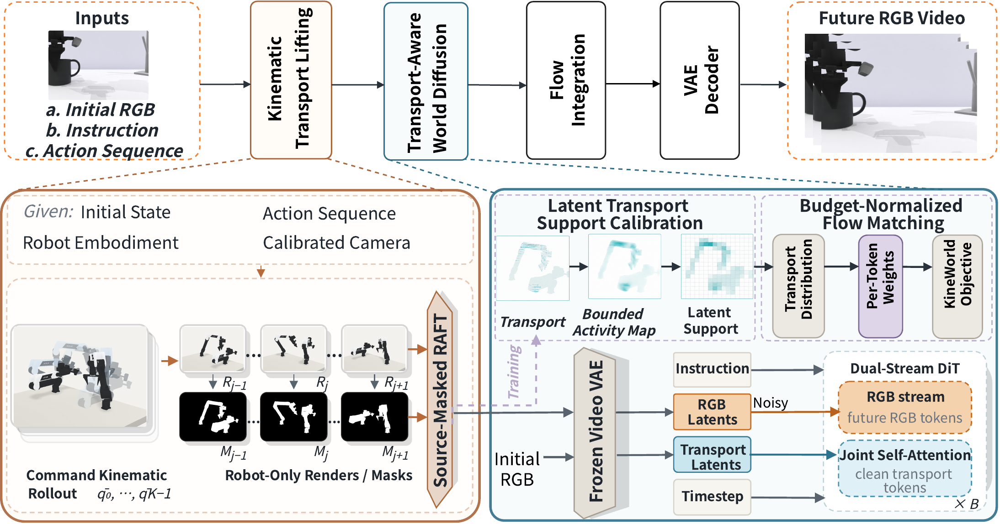

# KineWorld

KineWorld is an action-conditioned world model built on the Wan2.2-TI2V-5B video backbone. The code includes an RGB/optical-flow dual-stream generator, an action-prediction module, RoboTwin data preparation and policy integration, and a WorldArena2 Track 1 video-generation pipeline.

[**Project page: method figures and playable videos ↗**](https://pumpkin601.github.io/KineWorld/)



## Video samples

Three clips from the provided 1,000-video collection can be played on the [project page](https://pumpkin601.github.io/KineWorld/#videos). Their source checkpoint is not specified here.

| Sample 001 | Sample 312 | Sample 1000 |
| --- | --- | --- |
| [](https://pumpkin601.github.io/KineWorld/#videos) | [](https://pumpkin601.github.io/KineWorld/#videos) | [](https://pumpkin601.github.io/KineWorld/#videos) |

## Release status

This repository releases the source components listed below, method figures, and three video samples. It is not a complete reproduction package for the V4 manuscript. It contains no model weights, training data, or measured benchmark results. A checkpoint is required for inference. The step-500 checkpoint has not been shown to reproduce the V4 manuscript results. A source checkout or a dry run does not verify model quality.

## Public artifacts

- [KineWorld step-500 model repository](https://huggingface.co/pumpkin601/KineWorld): model card, paired action-normalization statistics, and public training configuration are available. The 13.1 GB Safetensors file is uploading.
- [KineWorld video dataset repository](https://huggingface.co/datasets/pumpkin601/KineWorld-1000-Videos): dataset card is available. The archive of 1,000 MP4 videos is uploading.

## Contents

| Directory | Purpose |
| --- | --- |
| `diffsynth/` | Wan video pipeline and dual-stream model components |
| `training/` | RoboTwin data reader, training objective, and training entry point |
| `inference/` | Action inference server and RoboTwin policy client |
| `track1/` | Action-flow preparation, WorldArena2 Track 1 generation, and output validation |
| `data_generation/` | Robot-only rendering patch for RoboTwin demonstrations |
| `configs/` | Public input templates for training and inference |

The local HCU cluster orchestration used for one training run is not part of this source package. `training/train.sh` retains the reference run's data and memory checks; it is not a claim that another dataset or hardware setup reproduces that run.

## Environment

Use Linux, Python 3.10 or newer, a CUDA-capable PyTorch installation appropriate for your device, and `ffmpeg` for MP4 output. Install PyTorch and torchvision following their own device-specific instructions, then install the package from this directory:

```bash
python -m pip install -r requirements.txt
python -m pip install -e . --no-deps
```

The base video weights are `Wan-AI/Wan2.2-TI2V-5B`; the tokenizer files come from `Wan-AI/Wan2.1-T2V-1.3B`. Download access, GPU memory, and compatible attention kernels depend on the inference environment. Robot-only action-flow rendering also needs a compatible RoboTwin checkout, SAPIEN/Vulkan runtime, and RAFT weights. These assets and third-party model weights are not included here and retain their own terms.

## WorldArena2 Track 1 inference

The default `action_flow` mode requires prepared action-flow files; it does not silently fall back to text-only generation. See [track1/README.md](track1/README.md) for preprocessing and output-validation commands. Once a compatible checkpoint is available:

```bash
python track1/infer_track1.py \
  --dataset-root /path/to/dataset_track1 \
  --output-root /path/to/kineworld_run \
  --checkpoint-path /path/to/checkpoint.safetensors \
  --conditioning-mode action_flow \
  --action-flow-provider precomputed \
  --precomputed-flow-root /path/to/action_flow \
  --device cuda:0
```

`--dry-run` checks episode discovery and sharding without loading a checkpoint. It is a data-path check, not an inference test.

## RoboTwin action policy

The inference server needs a compatible checkpoint and `action_norm_stats.npz` from the same training run:

```bash
CHECKPOINT=/path/to/checkpoint.safetensors \
ACTION_NORM_PATH=/path/to/action_norm_stats.npz \
bash inference/start_server.sh
```

The server binds to `127.0.0.1:8000` by default. The RoboTwin client and evaluation wrapper are in `inference/robotwin_policy/`; see their scripts for the required RoboTwin checkout and task arguments.

## Training inputs

`training/train.sh` requires an existing RoboTwin training root, a JSONL training manifest and its SHA-256, and a compatible warm-start checkpoint and its SHA-256. These are explicit inputs; the script verifies the manifest and checkpoint before launching. For example:

```bash
DATASET_BASE_PATH=/path/to/robotwin_training \
TRAINING_MANIFEST=/path/to/train.jsonl \
TRAINING_MANIFEST_SHA256=YOUR_64_HEX_SHA256 \
RESUME_CHECKPOINT=/path/to/warm_start.safetensors \
RESUME_CHECKPOINT_SHA256=YOUR_64_HEX_SHA256 \
NUM_GPUS=1 bash training/train.sh
```

The reference recipe uses head-camera RoboTwin data, 14-dimensional actions, robot-only optical flow, and a VRAM check calibrated for the original 64-GiB accelerator class. Other hardware or data need independent validation. The step-500 weight file is an output of training, not the warm-start input above.

## License and provenance

The code package contains an Apache-2.0 [LICENSE](LICENSE) and [third-party notices](NOTICE). Components adapted from DiffSynth-Studio and RoboTwin are identified there. Wan model weights, RoboTwin assets/data, and any other external components must be obtained under their respective licenses. The model card accompanying a future checkpoint should identify its base weights, warm-start checkpoint, training data, configuration, and evaluation evidence. No score is claimed by this source package.
