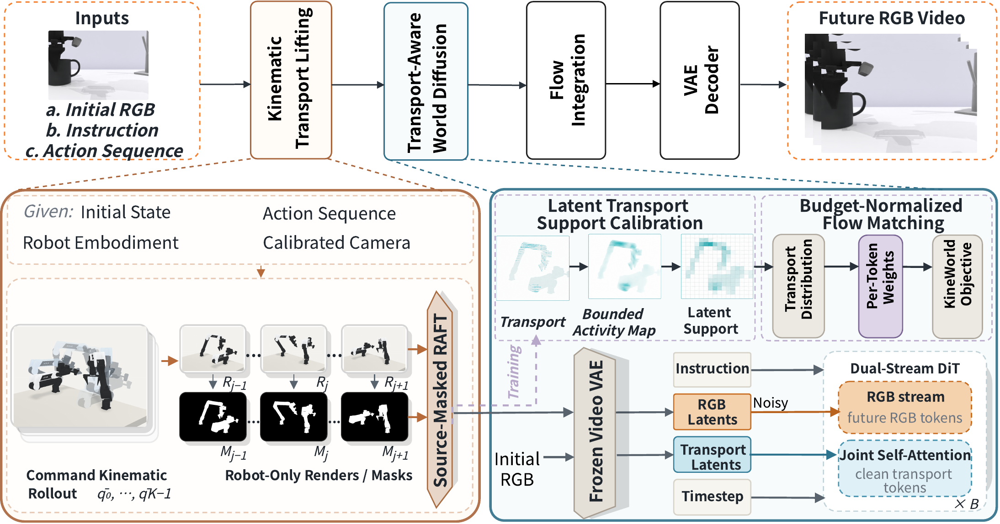
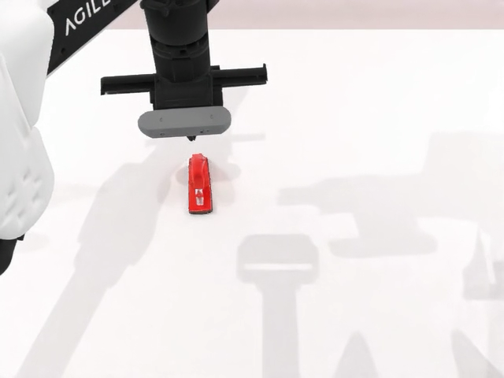
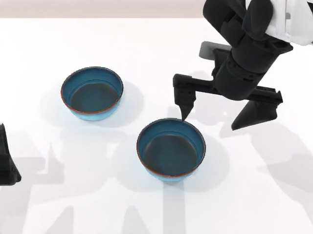
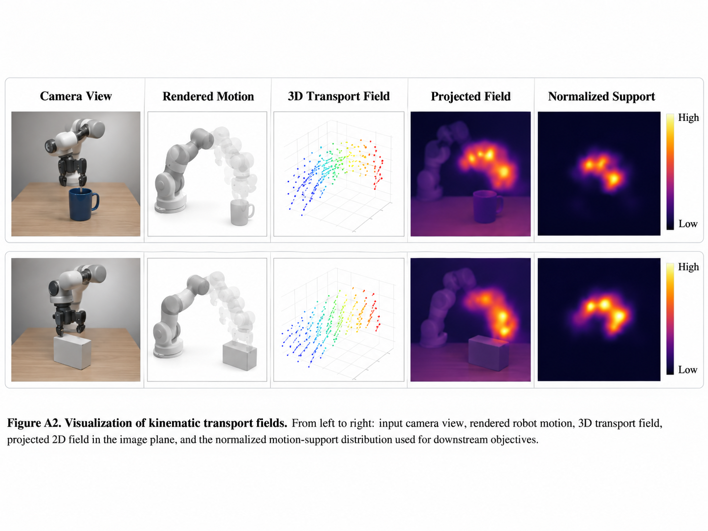
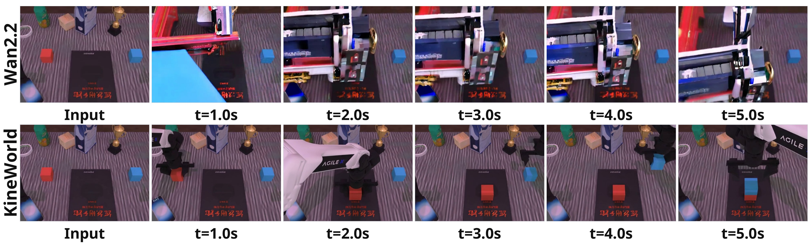

# KineWorld

[**中文使用指南：数据准备 → 下载模型 → 单条推理 → 继续训练**](README_zh-CN.md)

KineWorld is an action-conditioned world model built on the Wan2.2-TI2V-5B video backbone. The code includes an RGB/optical-flow dual-stream generator, an action-prediction module, RoboTwin data preparation and policy integration, and a WorldArena2 Track 1 video-generation pipeline.

[**Project page: method figures and playable videos ↗**](https://modaxiansheng.github.io/KineWorld/)



## Video samples

Three clips from the provided 1,000-video collection can be played on the [project page](https://modaxiansheng.github.io/KineWorld/#videos). Their source checkpoint is not specified here.

| Sample 001 | Sample 312 | Sample 1000 |
| --- | --- | --- |
| [](https://modaxiansheng.github.io/KineWorld/#videos) | [](https://modaxiansheng.github.io/KineWorld/#videos) | [](https://modaxiansheng.github.io/KineWorld/#videos) |

## More manuscript figures

The [project page](https://modaxiansheng.github.io/KineWorld/) includes the framework and transport figures, analytical TAWD illustrations, 15 additional single-view rollout pairs, and three multi-view validation plates from the V4 manuscript. The transport-support panel is conceptual; the rollout panels are qualitative examples, not benchmark results.





## Release status

This repository releases the source components listed below, method figures, and three video samples. It is not a complete reproduction package for the V4 manuscript. It contains no model weights, training data, or measured benchmark results. A checkpoint is required for inference. The step-500 checkpoint has not been shown to reproduce the V4 manuscript results. A source checkout or a dry run does not verify model quality.

## Public artifacts

- [KineWorld step-500 model repository](https://huggingface.co/pumpkin601/KineWorld): complete Safetensors checkpoint, paired action-normalization statistics, public training configuration, and SHA-256 checksums.
- [KineWorld video dataset repository](https://huggingface.co/datasets/pumpkin601/KineWorld-1000-Videos): archive of 1,000 MP4 videos, with archive size and SHA-256 recorded in the dataset card.

**Using the checkpoint:** follow [Model download](#model-download) and [Track 1 inference](#worldarena2-track-1-inference) below. For input layouts, preprocessing, offline setup, and the separate action-policy interface, see the [checkpoint usage guide](docs/checkpoint_usage.md).

## Contents

| Directory | Purpose |
| --- | --- |
| `diffsynth/` | Wan video pipeline and dual-stream model components |
| `training/` | RoboTwin data reader, training objective, and training entry point |
| `inference/` | Action inference server and RoboTwin policy client |
| `track1/` | Action-flow preparation, WorldArena2 Track 1 generation, and output validation |
| `data_generation/` | Robot-only rendering patch for RoboTwin demonstrations |
| `configs/` | Public input templates for training and inference |

The local HCU cluster orchestration used for one training run is not part of this source package. `training/train.sh` retains the reference run's checks under the default `audited` profile. The opt-in `public` profile accepts explicitly prepared local subsets for continued fine-tuning, with device-relative memory checks. Neither profile name is a claim of reproduced paper results.

## Environment

Use Linux, Python 3.10 or newer, a CUDA-capable PyTorch installation appropriate for your device, and `ffmpeg` for MP4 output. Install PyTorch and torchvision following their own device-specific instructions, then install the package from this directory:

```bash
git clone https://github.com/modaxiansheng/KineWorld.git
cd KineWorld
python -m pip install -r requirements.txt
python -m pip install -e . --no-deps
```

The base video weights are `Wan-AI/Wan2.2-TI2V-5B`; the tokenizer files come from `Wan-AI/Wan2.1-T2V-1.3B`. Download access, GPU memory, and compatible attention kernels depend on the inference environment. Robot-only action-flow rendering also needs a compatible RoboTwin checkout, SAPIEN/Vulkan runtime, and RAFT weights. These assets and third-party model weights are not included here and retain their own terms.

## Model download

Run the following Bash commands from the repository root. The released checkpoint is **`step-500.safetensors`** (13.11 GB), not a LoRA adapter or a standalone Diffusers pipeline. Use this repository's loader, rather than `DiffusionPipeline.from_pretrained("pumpkin601/KineWorld")`.

```bash
hf download pumpkin601/KineWorld \
  step-500.safetensors action_norm_stats.npz training_config_public.json SHA256SUMS \
  --revision 37e8f86c6c3cf45cde743162bf9b6de583cf1b73 \
  --local-dir checkpoints/KineWorld

(cd checkpoints/KineWorld && sha256sum -c SHA256SUMS)
```

`hf` is supplied by `huggingface_hub`. If it is unavailable, run `python -m pip install --upgrade huggingface_hub` in the same environment. Both checksum entries must report `OK`.

| File | Used for |
| --- | --- |
| `step-500.safetensors` | Full-mode training checkpoint containing DiT, clean-flow input weights, and the action expert; video-only inference skips the action expert |
| `action_norm_stats.npz` | Paired normalization for action-policy inference; not needed by the Track 1 video generator |
| `training_config_public.json` | Checkpoint-specific settings; reference metadata, not an inference config automatically loaded by the scripts |
| `SHA256SUMS` | Checksum verification for the checkpoint and normalization file |

Download the separate Wan dependencies into the layout expected by the loader. Keep the `Wan-AI/` subdirectory:

```bash
hf download Wan-AI/Wan2.2-TI2V-5B \
  --include 'diffusion_pytorch_model*.safetensors' \
            'models_t5_umt5-xxl-enc-bf16.pth' 'Wan2.2_VAE.pth' \
  --local-dir models/Wan-AI/Wan2.2-TI2V-5B

hf download Wan-AI/Wan2.1-T2V-1.3B \
  --include 'google/*' \
  --local-dir models/Wan-AI/Wan2.1-T2V-1.3B
```

These downloads are additional to the 13.11-GB checkpoint. The Track 1 loader can also fetch missing base files automatically. Complete the downloads before an offline run.

## WorldArena2 Track 1 inference

Use this entry point to generate videos from an initial image, instruction, and action trajectory. Prepare the official input collection and action-flow files first, following the [checkpoint usage guide](docs/checkpoint_usage.md#2-prepare-the-inputs) or [track1/README.md](track1/README.md). The default `action_flow` mode requires real per-chunk action flow; it does not silently fall back to text-only generation.

Start with one episode using the downloaded checkpoint:

```bash
python track1/infer_track1.py \
  --dataset-root /path/to/dataset_track1 \
  --output-root outputs/kineworld-step500-episode1 \
  --checkpoint-path checkpoints/KineWorld/step-500.safetensors \
  --model-cache-dir models \
  --conditioning-mode action_flow \
  --action-flow-provider precomputed \
  --precomputed-flow-root /path/to/action_flow \
  --episode-start 1 --episode-end 1 \
  --num-inference-steps 25 --seed 1 \
  --device cuda:0
```

The video is written to `outputs/kineworld-step500-episode1/videos/episode1.mp4` (640 x 480, 24 fps), with a run configuration and per-episode records. The default `--input-profile official` requires the complete `episode1` through `episode1000` input layout even when selecting one episode. For a single real RoboTwin episode, use `scripts/prepare_inference_episode.py` and `--input-profile custom`, following the [Chinese end-to-end guide](README_zh-CN.md). Custom inputs are not official submission inputs.

Alternatively, replace `--checkpoint-path ...` with these three options to download the checkpoint directly through the inference script. Do not combine the two checkpoint sources:

```bash
--checkpoint-repo pumpkin601/KineWorld \
--checkpoint-file step-500.safetensors \
--checkpoint-revision 37e8f86c6c3cf45cde743162bf9b6de583cf1b73
```

`--dry-run` checks discovery and sharding without loading a checkpoint or running the model. In custom mode it also validates selected images, instructions, and complete action arrays. It does not validate action-flow files or generated-video quality. A real smoke test must omit `--dry-run` and inspect the resulting MP4 and records.

## RoboTwin action policy

This is a separate, experimental interface that predicts actions, not the action-conditioned video generator above. It needs `action_norm_stats.npz` from the same release. **Do not use the generic `start_server.sh` defaults for step-500:** the published configuration uses head-camera input and `cond_layer_stride=2`, whereas that wrapper uses three cameras and stride 1. See the [explicit step-500 server command and its limitations](docs/checkpoint_usage.md#5-optional-action-policy-server) before using the RoboTwin client in `inference/robotwin_policy/`.

## Continued fine-tuning on your data

Follow the [Chinese dataset and training guide](README_zh-CN.md) for the complete commands, compatible official dataset download, robot-only rendering, train/validation/test split, model dependencies, and troubleshooting. The public route is:

1. Prepare paired legacy ALOHA–AgileX Clean-50 scene/robot-only HDF5 and instructions.
2. Run `scripts/prepare_robotwin_manifest.py` for explicit tasks and episode ranges. It validates files and writes separate content-pinned manifests.
3. Source `configs/train_public.example.env`, set the local dataset/manifest paths, and compute the manifest SHA-256. The template selects the released step-500 for weights-only warm-start.
4. Run `bash training/train.sh --dry-run` for CPU preflight, then `MAX_OPTIMIZER_STEPS=3 SAVE_STEPS=3 bash training/train.sh` for an actual GPU smoke run.
5. Use a new output directory for a longer run. Full optimizer-state resume is separate from weights-only fine-tuning.

The template explicitly enables `TRAINING_MANIFEST_PROFILE=public`. Without it, the default `audited` profile retains the historical fixed-manifest and 54–63 GiB checks. Public mode removes that artificial occupancy floor, not the need for sufficient real VRAM. The released checkpoint can initialize further training; it is not an optimizer-state snapshot of its original run.

**Objective scope:** the public clean-flow video path trains a spatially uniform future-RGB objective, not the paper's TAWD weighting. The new entry makes the released implementation usable for continued fine-tuning; it does not add an unverified TAWD implementation or claim manuscript reproduction. CPU tests and data preparation are not completed GPU training.

## License and provenance

The code package contains an Apache-2.0 [LICENSE](LICENSE) and [third-party notices](NOTICE). Components adapted from DiffSynth-Studio and RoboTwin are identified there. Wan model weights, RoboTwin assets/data, and any other external components must be obtained under their respective licenses. The [step-500 model card](https://huggingface.co/pumpkin601/KineWorld) records the release's training provenance and scope. No score is claimed by this source package.
