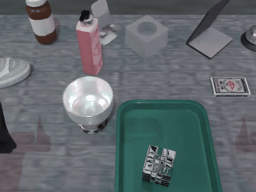
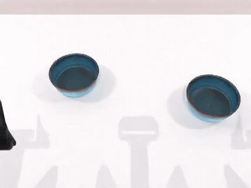

# KineWorld 中文使用指南

[English](README.md) · [项目主页](https://modaxiansheng.github.io/KineWorld/) · [模型下载](https://huggingface.co/pumpkin601/KineWorld)

本指南按 **准备环境 → 下载数据和模型 → 生成一条视频 → 准备训练数据 → 继续训练** 的顺序操作。建议先下载一个任务并跑通，再扩展到多个任务。所有命令均在 **Linux Bash** 下运行，除特别说明外，工作目录为 KineWorld 仓库根目录。

## 视频效果展示

以下动图来自已提供的 1,000 条视频集合，保留原始播放速度，以 360 × 270、10 fps 预览。点击下方链接查看原始 MP4，或在[项目主页](https://modaxiansheng.github.io/KineWorld/#videos)播放。现有记录未注明这些视频的来源 checkpoint，不将其标为公开 `step-500` 的复现结果。

| 示例 001 | 示例 312 | 示例 1000 |
| --- | --- | --- |
|  |  |  |
| [原始 MP4](docs/assets/sample_001.mp4) | [原始 MP4](docs/assets/sample_312.mp4) | [原始 MP4](docs/assets/sample_1000.mp4) |

## 先选择你要做什么

| 目标 | 使用入口 | 所需输入 | 输出 |
| --- | --- | --- | --- |
| 根据给定动作生成未来视频 | `track1/infer_track1.py --input-profile custom` | 初始图像、文字指令、14 维关节轨迹、预计算机器人运动条件、模型权重 | MP4 和逐 episode 记录 |
| 在自己的 RoboTwin 子集上继续训练 | `training/train.sh --profile public` | 场景 RGB、对应 robot-only 渲染、动作、指令、训练清单、已有权重 | 新权重、训练状态、动作归一化统计 |
| 生成官方 Track 1 测试视频 | `track1/infer_track1.py --input-profile official` | 独立取得的完整 1,000 条官方输入 | 官方输入协议下的生成视频 |
| 根据观测预测机器人动作 | [动作策略接口](docs/checkpoint_usage.md#5-optional-action-policy-server) | 图像、指令、当前关节状态 | 动作序列，不是 MP4 |

这里的公开训练流程是从已发布 `step-500` **继续微调**，不是从零预训练。当前公开训练代码的未来 RGB 目标采用空间均匀加权；文中的 TAWD 加权目标不是这个入口已实现的选项。该流程用于使用与扩展公开 checkpoint，不等同于完整复现论文结果。

## 1. 安装环境

需要 Python 3.10+、与你的 CUDA 匹配的 PyTorch/torchvision、Git、`ffmpeg`、`ffprobe`、`unzip` 和 `curl`。先按 [PyTorch 官方安装说明](https://pytorch.org/get-started/locally/) 安装匹配的 PyTorch/torchvision，再安装本项目。

```bash
git clone https://github.com/modaxiansheng/KineWorld.git
cd KineWorld
python -m pip install -r requirements.txt
python -m pip install -e . --no-deps
python -m pip install --upgrade huggingface_hub

export KINEWORLD_ROOT="$PWD"
python -c "import torch, torchvision; print(torch.__version__, torchvision.__version__); print('CUDA available:', torch.cuda.is_available())"
ffmpeg -version
ffprobe -version
```

下载和数据检查可在 CPU 上完成，实际生成与训练需要适配的 GPU 环境。`13.11 GB` 是 checkpoint 的磁盘大小，不是显存要求。单 GPU 命令用于最小配置示范，并不保证任意消费级 GPU 能容纳完整模型、梯度与优化器状态。

后文涉及 robot-only 渲染，还需要 RoboTwin 机器人资产、SAPIEN 和可用的 Vulkan 驱动，见第 4 节。不要把渲染环境安装失败当作模型权重损坏。

## 2. 下载模型

### 2.1 KineWorld 权重

```bash
hf download pumpkin601/KineWorld \
  step-500.safetensors action_norm_stats.npz training_config_public.json SHA256SUMS \
  --revision 37e8f86c6c3cf45cde743162bf9b6de583cf1b73 \
  --local-dir checkpoints/KineWorld

(cd checkpoints/KineWorld && sha256sum -c SHA256SUMS)
```

两项校验均应显示 `OK`。

| 文件 | 用途 |
| --- | --- |
| `step-500.safetensors` | 约 13.11 GB，含 DiT、flow 条件输入及动作专家参数；不是 LoRA |
| `action_norm_stats.npz` | 与该权重配套的动作策略归一化统计，视频生成不需要它 |
| `training_config_public.json` | 发布权重的配置说明；不会被推理脚本自动读取 |
| `SHA256SUMS` | 权重和动作统计的完整性校验 |

KineWorld 需要本仓库的专用加载器，不能直接用 `DiffusionPipeline.from_pretrained("pumpkin601/KineWorld")` 加载。

### 2.2 Wan 基础模型与 tokenizer

即使已经下载 KineWorld，仍需单独下载 VAE、文本编码器、DiT 基础文件及 tokenizer。保留下面的 `models/Wan-AI/` 层级。

```bash
hf download Wan-AI/Wan2.2-TI2V-5B \
  --include 'diffusion_pytorch_model*.safetensors' \
            'models_t5_umt5-xxl-enc-bf16.pth' 'Wan2.2_VAE.pth' \
  --local-dir models/Wan-AI/Wan2.2-TI2V-5B

hf download Wan-AI/Wan2.1-T2V-1.3B \
  --include 'google/*' \
  --local-dir models/Wan-AI/Wan2.1-T2V-1.3B
```

### 2.3 RAFT 权重

运动条件使用 RAFT-large。训练和预计算脚本按本地文件加载，不会在缺失时静默改用其他光流算法。

```bash
mkdir -p models/raft
curl -fL --retry 3 \
  https://download.pytorch.org/models/raft_large_C_T_SKHT_V2-ff5fadd5.pth \
  -o models/raft/raft_large_C_T_SKHT_V2-ff5fadd5.pth
export KINEWORLD_RAFT_WEIGHTS_PATH="$KINEWORLD_ROOT/models/raft/raft_large_C_T_SKHT_V2-ff5fadd5.pth"

python -c "from training.raft_flow_extractor import verify_raft_weights_file; print(verify_raft_weights_file())"
```

程序校验该文件大小及 SHA-256。新终端中需要重新设置 `KINEWORLD_RAFT_WEIGHTS_PATH`，或将文件放入相同用户的 Torch Hub checkpoint 缓存。

## 3. 准备 RoboTwin 数据

### 3.1 先下载一个任务

训练输入来自 [RoboTwin 2.0 官方数据仓库](https://huggingface.co/datasets/TianxingChen/RoboTwin2.0)，不是 KineWorld 的生成视频集。下面固定下载兼容的旧版 **ALOHA–AgileX Clean-50** 归档。不要直接换成新版 `demo_clean.zip`，两者的数据布局和图像编码可能不同。

```bash
hf download TianxingChen/RoboTwin2.0 --repo-type dataset \
  dataset/place_dual_shoes/aloha-agilex_clean_50.zip \
  --revision 3dc3b798668feb99ac61cc9086d84cbcc3d79186 \
  --local-dir downloads/RoboTwin2.0

sha256sum downloads/RoboTwin2.0/dataset/place_dual_shoes/aloha-agilex_clean_50.zip
mkdir -p data/robotwin/place_dual_shoes
unzip -n downloads/RoboTwin2.0/dataset/place_dual_shoes/aloha-agilex_clean_50.zip \
  -d data/robotwin/place_dual_shoes
```

这个归档约 628 MB，SHA-256 应为 `0cdb0e5c03a30332c928cce1c430a21da8248adc01608706487709283168f703`。归档自身已含 `aloha-agilex_clean_50/` 顶层，解压目标必须是任务目录，不要多套一层同名目录。

```text
data/robotwin/
└── place_dual_shoes/
    └── aloha-agilex_clean_50/
        ├── data/episode0.hdf5 ... episode49.hdf5
        ├── instructions/episode0.json ... episode49.json
        └── robot_only/data/episode0.hdf5 ... episode49.hdf5  # 第 6 节生成
```

仅做第 5 节视频推理时，不需要提前生成这里的全部 `robot_only/`，只需为选中的 episode 预计算运动条件。

### 3.2 文件字段与动作约定

- 场景 HDF5 需要 `/observation/head_camera/rgb` 和逐帧动作。
- 动作是 ALOHA–AgileX **关节位置**，顺序为 `[左臂 6, 左夹爪 1, 右臂 6, 右夹爪 1]`，合计 14 维。臂关节保留原始位置，两个夹爪值按原数据约定为 **[0,1]**。不要把另一种 14 维末端位姿、整向量标准化后的策略动作或增量动作直接当作它。
- 单条推理适配器接受 `/joint_action/vector`，也可从 `left_arm`、`left_gripper`、`right_arm`、`right_gripper` 四个分量拼接。**训练和 robot-only 渲染必须保留这四个分量字段**，不能只提供 vector。RGB 与动作长度必须一致，动作不得含 NaN/Inf。
- 训练使用指令 JSON 中显式选定的 `seen` 文本。不要用空字符串补齐缺失指令。
- 训练清单检查器支持该旧版归档的 JPEG 编码，对带 `XPL-RGB1` 标记的新格式会明确报错，避免红蓝通道静默颠倒。单条推理适配器另外支持带标记的标准 RGB JPEG 和已解码 RGB 数组。

自己的数据必须满足相同机器人、关节顺序、相机标定和文件约定。其他机器人或相机不能只改目录名，需要相应适配渲染与条件构造。

### 3.3 训练、验证、测试划分

本指南为每个任务固定以下本地划分。

| 用途 | episode 编号 | 一个任务 | 50 个完整任务 |
| --- | --- | --- | --- |
| 训练 | 0–35 | 36 | 1,800 |
| 验证 | 36–39 | 4 | 200 |
| 留出测试 | 40–49 | 10 | 500 |

这是同任务内 episode 划分，不是任务不相交划分。实际清单数量以检查器输出为准，缺文件会报错，不会偷偷丢弃样本。这里的留出只针对你这次继续训练的数据选择，不代表已发布父 checkpoint 从未见过相同数据。官方评测输入也不应加入训练。

## 4. 准备机器人渲染资产

本仓库提供的渲染补丁使用 RoboTwin 2.0 的 `script/`、`task_config/` 接口。为避免当前主分支改版造成路径不一致，下面固定到已检查过这些接口的版本。

```bash
git clone --branch stable_2.0 https://github.com/RoboTwin-Platform/RoboTwin.git ../RoboTwin-KineWorld
git -C ../RoboTwin-KineWorld checkout 13c3c47ff4312dd62484bcd51be034af55c062d1
export ROBOTWIN_ROOT="$(cd ../RoboTwin-KineWorld && pwd)"
```

在独立的 RoboTwin 环境中，按该版本的安装脚本和 [官方安装说明](https://robotwin-platform.github.io/doc/usage/robotwin-install.html) 配置 CUDA/SAPIEN/Vulkan，再下载资产。该版本依赖列表包含 `sapien==3.0.0b1`，不要把新版本环境整体覆盖到模型环境。

```bash
cd "$ROBOTWIN_ROOT"
bash script/_install.sh
bash script/_download_assets.sh
test -f assets/embodiments/aloha-agilex/config.yml
cd "$KINEWORLD_ROOT"
```

第 5 节的 `precompute_action_flow.py` 在模型环境中运行，也需要兼容的 SAPIEN 渲染运行时。

```bash
# 在 KineWorld 模型环境中执行；Vulkan 驱动仍由宿主机提供。
python -m pip install 'sapien==3.0.0b1'
```

`--robotwin-assets-root` 应指向 **`$ROBOTWIN_ROOT/assets`**，其下应有 `embodiments/aloha-agilex/`，不是直接指向 RoboTwin 仓库根目录。

## 5. 推理一条真实 episode

### 5.1 从原始数据生成输入目录

以下从本地留出的 `episode40` 准备一条输入，重新编号为输出集合中的 `episode1`。编号变化只为适配文件命名，不会截断、插值或替换原始动作。准备记录保留原路径、哈希、指令选择和帧数。

```bash
python scripts/prepare_inference_episode.py \
  --hdf5 data/robotwin/place_dual_shoes/aloha-agilex_clean_50/data/episode40.hdf5 \
  --instruction-json data/robotwin/place_dual_shoes/aloha-agilex_clean_50/instructions/episode40.json \
  --instruction-key seen --instruction-index 0 \
  --output-root data/custom_episode40 \
  --episode-id 1
```

输出目录如下。

```text
data/custom_episode40/
├── data/fixed_scene_task/episode1.hdf5
├── first_frame/fixed_scene_task/episode1.png
├── instructions/fixed_scene_task/episode1.json
└── preparation/episode1.json
```

PNG 是原始第 0 帧，JSON 使用选定的原始指令，HDF5 保留整条轨迹。指令在视频推理时原样编码，不会自动添加训练时的 Track 1 prompt 前缀；进行对照时需固定相同的文本格式。

先进行 CPU 输入检查，不加载模型。

```bash
python track1/infer_track1.py \
  --input-profile custom \
  --dataset-root data/custom_episode40 \
  --output-root outputs/episode40-step500 \
  --episode-start 1 --episode-end 1 \
  --dry-run
```

应看到 `selected_contents_validated: true`。这只表示所选图像、动作、指令通过输入检查，不代表已经生成视频或验证光流文件。

### 5.2 预计算动作驱动的运动条件

```bash
python track1/precompute_action_flow.py \
  --dataset-root data/custom_episode40 \
  --output-root outputs/action_flow_episode40 \
  --robotwin-assets-root "$ROBOTWIN_ROOT/assets" \
  --render-width 640 --render-height 480 \
  --target-width 320 --target-height 240 \
  --episode-start 1 --episode-end 1 \
  --flow-device cuda:0
```

该步骤重放给定关节轨迹，渲染 robot-only 图像并计算 RAFT 光流，保存分 chunk 的条件图和 manifest。模型推理需要这些文件，普通 MP4 光流视频不能直接替代。缺文件时应修复预计算，不能切换 `zero_flow` 冒充相同条件推理。

### 5.3 加载 checkpoint 生成视频

```bash
python track1/infer_track1.py \
  --input-profile custom \
  --dataset-root data/custom_episode40 \
  --output-root outputs/episode40-step500 \
  --checkpoint-path checkpoints/KineWorld/step-500.safetensors \
  --model-cache-dir models \
  --conditioning-mode action_flow \
  --action-flow-provider precomputed \
  --precomputed-flow-root outputs/action_flow_episode40 \
  --episode-start 1 --episode-end 1 \
  --num-inference-steps 25 --seed 1 \
  --device cuda:0
```

成功后检查：

```text
outputs/episode40-step500/
├── videos/episode1.mp4
├── per_episode/episode1.json
├── run_config.json
└── status/
```

模型每 chunk 生成 9 个关键帧，再展开到动作定义的序列长度，以 `640×480 / 24 fps` 导出。24 fps 是播放帧率，不是生成速度。视频推理只加载 DiT 和干净 flow 条件所需权重，跳过动作专家；缺少 `flow_head.*` 对这一路径是预期行为。

### 5.4 检查输出，再扩大规模

```bash
python track1/validate_track1.py outputs \
  --dataset-root data/custom_episode40 \
  --videos-dir outputs/episode40-step500/videos \
  --records-dir outputs/episode40-step500/per_episode \
  --run-config outputs/episode40-step500/run_config.json \
  --episode-start 1 --episode-end 1 \
  --output-json outputs/episode40-step500/validation_report.json
```

此检查覆盖文件、帧数、分辨率、帧率及条件记录，不计算论文综合指标。还应播放 MP4 检查内容。

增加 episode 时，用不同 `--episode-id` 导出到同一 custom 根目录，并同步扩展预计算和推理范围。不同模型或配置使用不同输出目录。**官方模式仍默认要求完整 1–1000 输入；单条数据必须显式传 `--input-profile custom`。** 不要把自定义样例目录用于官方提交。

## 6. 准备继续训练的数据

### 6.1 为训练 episode 生成配对 robot-only 渲染

训练不能只使用第 5 节的首帧目录，还需要原始场景 RGB 和每帧对应的 robot-only 渲染。将补丁复制到刚准备的 RoboTwin checkout。

```bash
cp data_generation/script/render_robot_only.py "$ROBOTWIN_ROOT/script/render_robot_only.py"
cp data_generation/envs/utils/robot_only_renderer.py "$ROBOTWIN_ROOT/envs/utils/robot_only_renderer.py"
cp configs/robotwin_render.example.yml "$ROBOTWIN_ROOT/task_config/aloha-agilex_clean_50.yml"
```

打开复制后的 `task_config/aloha-agilex_clean_50.yml`，只需将 `save_path` 改成 **本机 `$KINEWORLD_ROOT/data/robotwin` 的实际绝对路径**。YAML 不会自动展开 `$KINEWORLD_ROOT`。保留 `embodiment: [aloha-agilex]`。

在 RoboTwin 渲染环境执行：

```bash
cd "$ROBOTWIN_ROOT"
python script/render_robot_only.py place_dual_shoes aloha-agilex_clean_50
cd "$KINEWORLD_ROOT"
```

确认 `data/robotwin/place_dual_shoes/aloha-agilex_clean_50/robot_only/data/episode0.hdf5` 等文件已经生成，帧数与场景文件一致。不要把场景 RGB 复制成 robot-only，也不要用另一条轨迹的渲染补齐缺失文件。

### 6.2 生成经过检查的清单

回到 KineWorld 模型环境。

```bash
python scripts/prepare_robotwin_manifest.py \
  --data-root data/robotwin \
  --tasks place_dual_shoes \
  --source-revision 3dc3b798668feb99ac61cc9086d84cbcc3d79186 \
  --output-dir manifests/place_dual_shoes
```

输出 `train.jsonl`、`val.jsonl`、`test.jsonl`、各自的 `.sha256` 和 `manifest_summary.json`。对于完整单任务，应为 `36 / 4 / 10`。脚本验证选定的原始/渲染 RGB、动作、指令、帧数和文件哈希；任何选定文件缺失或损坏都会报错，不会自动缩小清单。

只调试数据格式时，可以另建极小子集，避免首次就处理全部任务。

```bash
python scripts/prepare_robotwin_manifest.py \
  --data-root data/robotwin --tasks place_dual_shoes \
  --train-episodes 0 --val-episodes none --test-episodes none \
  --source-revision 3dc3b798668feb99ac61cc9086d84cbcc3d79186 \
  --output-dir manifests/place_dual_shoes_smoke
```

这只生成单 episode 训练清单，没有验证/测试结果。要扩展多个任务，下载对应的 `dataset/<task>/aloha-agilex_clean_50.zip` 到各任务目录，分别完成 robot-only 渲染，再在 `--tasks` 后显式列出任务名。新清单用新目录，避免覆盖已绑定到训练运行的旧清单。

## 7. 训练模型

### 7.1 加载公开继续训练配置

以下使用第 6.2 节的完整单任务清单。先读取模板，再覆盖本地路径和自动计算的 SHA-256，**无需手填训练清单哈希**。

```bash
source configs/train_public.example.env
export DATASET_BASE_PATH="$KINEWORLD_ROOT/data/robotwin"
export TRAINING_MANIFEST="$KINEWORLD_ROOT/manifests/place_dual_shoes/train.jsonl"
export TRAINING_MANIFEST_SHA256="$(sha256sum "$TRAINING_MANIFEST" | awk '{print $1}')"
export RESUME_CHECKPOINT="$KINEWORLD_ROOT/checkpoints/KineWorld/step-500.safetensors"
export MODEL_CACHE_DIR="$KINEWORLD_ROOT/models"
export OUTPUT_PATH="$KINEWORLD_ROOT/outputs/train-place_dual_shoes-smoke"
export NUM_GPUS=1
export DEVICE_LIST=0
```

模板已指定发布 checkpoint 的 SHA-256，以及以下结构设置。

| 设置 | 值 |
| --- | --- |
| 数据/相机 | `aloha-agilex_clean_50` / `head_camera` |
| 动作帧 / 视频关键帧 / visual stride | 33 / 9 / 4 |
| 图像尺寸 | 320×240，内部按 VAE 要求对齐 |
| 动作专家层数 / 条件层间隔 | 30 / 2 |
| 条件特征停止梯度 | `COND_DETACH=true` |
| 视频目标 | `track1_conditional_rgb`，flow 为干净条件 |
| flow / action loss 系数 | 0 / 1 |
| 每进程 batch size | 1 |
| 学习率 / 调度长度 / warmup | `1e-4` / 500 / 25 updates |

不要直接使用历史 `audited` 默认入口训练自有数据。`public` 模式接受自己生成并校验的子集；`audited` 保留历史固定清单与硬件门槛，两者用途不同。

### 7.2 先做 CPU 预检查

```bash
bash training/train.sh --dry-run
```

应输出 `preflight_passed_not_trained`。检查内容包括数据清单及文件一致性、checkpoint 完整性与结构、基础模型文件和 tokenizer 是否齐全、输出目录是否可用于新运行。它不会加载 GPU、下载模型或执行优化器更新。该检查读取较大的权重和数据文件，需要一定时间。

### 7.3 进行 3 步真实训练试跑

```bash
MAX_OPTIMIZER_STEPS=3 SAVE_STEPS=3 bash training/train.sh
```

成功标准是实际日志完成 3 次 optimizer update，并产生 `step-3.safetensors`。仅启动进程、通过预检查或创建日志目录都不是训练成功。

公开配置不要求人为占满 54 GiB 显存，而是默认在第 3 次更新检查每张卡的显存占用上限为设备容量的 95%。这并不等于模型一定装得下；若 OOM，检查设备容量、其他进程占用、梯度检查点和进程数，不要绕过数据或 checkpoint 校验来解决显存问题。

### 7.4 开始更长的继续训练

3 步试跑后先检查日志和输出，再使用**新目录**启动所需预算。例如：

```bash
export OUTPUT_PATH="$KINEWORLD_ROOT/outputs/train-place_dual_shoes-500updates"
export NUM_EPOCHS=20
MAX_OPTIMIZER_STEPS=500 SAVE_STEPS=100 bash training/train.sh
```

`MAX_OPTIMIZER_STEPS` 是停止上限，实际更新数还受 episode 数、epoch 数、GPU 数、batch size 和梯度累积影响；它不是强制补足步数的循环。以上数值是使用示例，不是宣称新的最优训练配方。

预期输出包括权重、`action_norm_stats.npz`、日志和 `state/step-*/trainer_state.json` 等完整训练状态。新的动作统计仅由当前训练清单计算；如后续使用动作策略接口，应搭配该次训练输出的统计，不要继续使用父 checkpoint 的统计。

### 7.5 区分重新微调和断点恢复

- `RESUME_CHECKPOINT=...safetensors` 是**仅加载权重**开始新训练。公开 `step-500` 不包含原运行的优化器状态，不能据此恢复原训练进度。
- `RESUME_STATE_DIR=.../state/step-N` 才用于恢复本次运行保存的模型、优化器、调度器与 RNG 状态。保留原训练清单、配置和输出目录；代码会核对运行绑定，不能任意更改预算/调度器后仍称为精确恢复。
- 使用自己训练出的权重做视频推理时，只需把第 5.3 节 `--checkpoint-path` 换成新权重，并使用新输出目录。动作流、输入和推理参数应保持明确。

## 8. 常见问题

| 问题 | 处理方式 |
| --- | --- |
| 只有一条数据却提示 episode 集合不完整 | 推理加 `--input-profile custom`，并明确 `--episode-start/--episode-end` |
| 下载的是 1,000 个 MP4，为什么不能训练 | 那是生成结果，不含训练所需场景、动作、指令和配对渲染 |
| 缺少 robot-only 文件 | 按第 6.1 节渲染，不要复制场景帧或使用其他轨迹补齐 |
| 提示 `XPL-RGB1` 或图像编码不兼容 | 训练使用第 3 节固定的 legacy 归档，不要直接换新版数据 |
| 提示训练清单 SHA 不匹配 | 核对清单是否修改；更换数据应生成新清单和新运行，而不是跳过校验 |
| 报错缺 RAFT 权重 | 完成第 2.3 节，检查当前终端的 `KINEWORLD_RAFT_WEIGHTS_PATH` |
| SAPIEN/Vulkan 报错或无渲染设备 | 检查宿主机驱动、容器图形能力和 RoboTwin/SAPIEN 版本 |
| 模型重复下载或找不到 tokenizer | 保留 `models/Wan-AI/<仓库名>/`，检查是否下载齐全部 DiT 分片 |
| 训练输出目录非空 | 新的仅权重微调用新目录；已有训练需要完整状态才能断点恢复 |
| 想复现 TAWD 消融 | 当前公开训练目标没有该开关；不要把 flow 分支权重误当未来 RGB 的 TAWD 权重 |

## 验证范围与进一步说明

新增入口包含 CPU 单元测试；单条数据适配还用上述固定版本的真实 `place_dual_shoes/episode40` 验证了 217 帧动作、320×240 首帧、原始指令与 custom 输入检查。该检查未运行 GPU 视频生成或训练，不代表模型质量测试。

论文结果、公开权重和示例命令的范围见 [模型卡](https://huggingface.co/pumpkin601/KineWorld)。动作策略的采样流程与视频生成不同，详见 [英文 checkpoint 指南](docs/checkpoint_usage.md)。第三方模型、RoboTwin 数据和资产分别遵循其原有许可。
